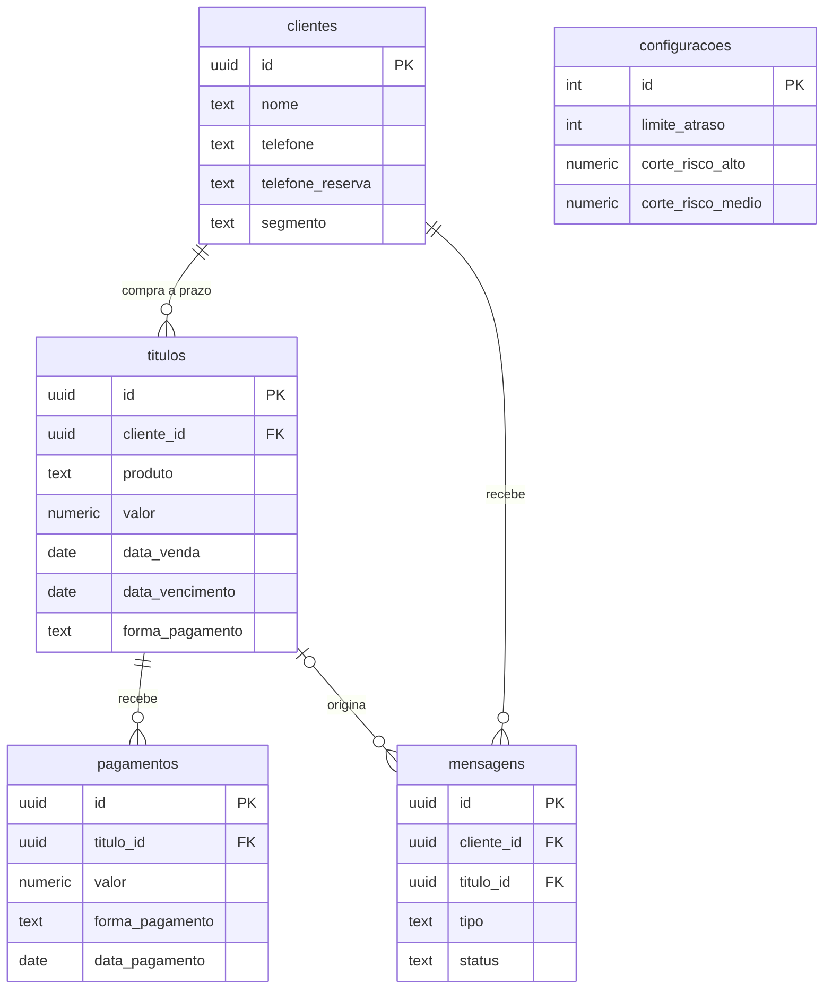

# Central de Crédito

> Sistema web para controlar **vendas a prazo ("fiado")**: quem deve, quanto, até quando — e quem tem mais risco de não pagar.

*English summary: a web app to manage store-credit ("pay later") sales — customers, receivables, partial payments, default-risk scoring and, on the roadmap, WhatsApp collection reminders and a cash-flow forecast. Built with Next.js (App Router + Server Actions) and Supabase (PostgreSQL).*

**Status:** 🚧 em desenvolvimento — Fases 1 a 5 concluídas; próxima: Fase 6 (régua de cobrança por WhatsApp).

---

## O problema

Pequenos negócios que vendem a prazo costumam controlar tudo em caderno ou planilha: fica difícil saber quem está atrasado, quanto falta receber e de quem cobrar primeiro.

Este é um projeto real, desenvolvido sob demanda para um cliente, e vai ser usado no dia a dia por **uma pessoa idosa**. Por isso o critério de design mais importante é **simplicidade**: poucos passos, botões grandes, mensagens claras em português e confirmação antes de qualquer ação que não dá pra desfazer.

## O que já funciona

- Cadastro de cliente **junto com a primeira compra**, num único formulário.
- Lista de clientes e **ficha do cliente** com todos os títulos: valor, pago, restante, vencimento, forma de pagamento e status (em aberto / atrasado / pago).
- **Pagamento parcial**, com validação para não pagar mais do que falta.
- **Marcar título como pago** e **marcar tudo como pago** (todos os títulos em aberto do cliente de uma vez).
- **Nova compra** para cliente já cadastrado: quem quitou tudo continua salvo, com o histórico, sem precisar de novo cadastro.
- **Busca de cliente pelo nome**, na página inicial e na lista: ignora acento e maiúscula ("jose" acha "José"), acha pedaço do nome e não liga pra ordem das palavras. Se ninguém for encontrado, oferece cadastrar como cliente novo. Cliente que já quitou tudo continua na base: é só buscar e usar "+ Nova compra".
- **Risco de inadimplência**: cada cliente recebe uma nota de 0 a 100 e uma etiqueta (baixo / médio / alto) com o motivo em uma frase, na lista e na ficha.
- **Tela "Hoje"** (a própria página inicial): total vencido, quantos clientes precisam de atenção, quantos atrasados nunca foram cobrados, o atraso mais antigo e o total a vencer em 30 dias; o cliente de maior risco em destaque, com o motivo; e a **fila de cobrança do dia**, do risco mais alto ao mais baixo.
- **"Já cobrei"**: um clique (com confirmação) tira o cliente da fila por alguns dias (`dias_repetir_cobranca`); passado o prazo ele volta sozinho. Se clicou por engano, dá pra desfazer.
- **Previsão de caixa** (`/previsao`): quanto deve entrar nas próximas 4 semanas. Compara a **soma dos vencimentos** com a **previsão ajustada pelo risco** de cada cliente, mostra a diferença e um gráfico de barras por período (já vencidos e semanas 1 a 4), com os valores escritos ao lado e uma versão em tabela.
- Mensagens de sucesso/erro, confirmação antes de marcar como pago e proteção contra clique duplo.

## Como o risco é calculado

Nota = **atraso atual** (até 60) + **perfil do cliente** (até 20) + **mudança de padrão** (peso configurável, 20 por padrão) + **vários títulos abertos** (15).

| Parte | Regra |
|---|---|
| Atraso atual | Título em aberto mais atrasado: cada dia vale `60 ÷ limite_atraso` pontos, até 60. |
| Perfil | Cliente **novo** (nada quitado ainda): 10 pontos. Cliente **antigo**: até 20, conforme a proporção dos títulos quitados que foram pagos com atraso (sempre em dia = 0). |
| Mudança de padrão | Soma o peso se o cliente já quitou 3+ títulos, todos em dia, e agora atrasou. |
| Vários títulos abertos | +15 se o cliente tem mais de um título em aberto ao mesmo tempo (valor fixo, não é por título). |

Alto a partir de 55 pontos, médio a partir de 25 (cortes em `configuracoes`). Com os valores iniciais e um título aberto, um cliente novo vira médio com 4 dias de atraso e alto com 12; um antigo que sempre pagou em dia, com 7 e 14. Com dois títulos abertos, o cliente novo já começa no médio (10 + 15 = 25), mesmo sem atraso. A fórmula é uma função pura em [`lib/risco.js`](lib/risco.js), coberta por testes (`npm test`), e os parâmetros ficam no banco para serem ajustados com dados reais (Fase 9).

## Como a previsão de caixa é calculada

Para cada cliente: **previsão = saldo em aberto × chance de pagar**, com chance = `max(0,15; 1 − nota de risco ÷ 130)`. Cliente sem risco tem 100% de chance; com a nota máxima (100), cerca de 23%. Os títulos são separados por período: **já vencidos** (ainda podem ser recebidos), **semana 1** (hoje a hoje+6), **semanas 2, 3 e 4**. O que vence depois de 4 semanas fica de fora da conta e aparece só como um aviso. A diferença entre a soma dos vencimentos e a previsão é o que a nota de risco indica que pode não entrar. A conta é uma função pura em [`lib/previsao.js`](lib/previsao.js), em centavos, com testes: cada valor previsto é arredondado uma vez só, então gráfico, tabela e totais fecham no centavo.

## Decisões técnicas (e por quê)

| Decisão | Motivo |
|---|---|
| **Sem tela de login; todo acesso ao banco é server-side** (Server Components / Server Actions com a chave `service_role`) | Ferramenta de um único negócio, sem multiusuário. A chave nunca chega ao navegador. Se um dia houver mais de um usuário, o próximo passo é adicionar autenticação. |
| **RLS ligado em todas as tabelas, sem nenhuma política** | Bloqueia totalmente a chave pública (`anon`) caso ela seja usada por engano no navegador. |
| **Pagamentos em tabela própria** (uma linha por pagamento), não um campo acumulado | Dá histórico, permite forma de pagamento diferente por parcela e corrigir um lançamento sem bagunçar o total. |
| **Saldo calculado numa view SQL** (`titulos_com_saldo`) | Fonte única da verdade: `valor_pago`, `valor_restante`, `dias_atraso` e `status` nunca são recalculados à mão nas telas. |
| **Dinheiro em centavos inteiros no código** e `numeric(12,2)` no banco | Evita erros de ponto flutuante ao comparar e somar valores. |
| **"Hoje" no fuso de Brasília** (`America/Sao_Paulo`), na view e no app | O banco roda em UTC: sem isso, a partir das 21h um título que vence hoje aparecia como atrasado. Bug real, encontrado e corrigido. |
| **Ações idempotentes** | "Marcar como pago" relê o saldo no servidor na hora do clique; um clique duplo não paga duas vezes. |
| **Server Actions em vez de API routes** | Menos código e menos superfície: cada formulário chama direto a função do servidor. |
| **Motor de risco como função pura, testada, com parâmetros no banco** | Regra de negócio fácil de testar e de ajustar sem mexer em código. O histórico é lido página por página: o Supabase limita 1000 linhas por consulta, e ler só a primeira daria nota errada sem avisar. |
| **Tela "Hoje" também como função pura** (`lib/hoje.js`), separada da leitura do banco | Contagens, ordem da fila e prazos são testados sem precisar de banco nem de navegador. |
| **"Já cobrei" grava na tabela `mensagens`** (a mesma que a régua de WhatsApp vai usar) | A fila e o contador de "nunca cobrados" já funcionam agora, e a Fase 6 entra sem migração: as mensagens automáticas passam a contar como cobrança do mesmo jeito. |
| **WhatsApp via Baileys** (biblioteca não-oficial, conexão por QR code), não a Cloud API oficial da Meta | Fase de demonstração pra fechar negócio: a Cloud API exige verificação de empresa e aprovação de template antes de mandar qualquer mensagem, o que atrasa mostrar o sistema funcionando. Baileys manda texto livre na hora. Em troca, roda como processo à parte (`scripts/whatsapp-bot.mjs`), não dá pra hospedar na Vercel (serverless), e tem risco (baixo, com o volume daqui) de bloqueio por não ser API oficial — mitigado com limite de mensagens por hora/dia e atraso aleatório entre envios. Reavaliar se/quando for pra produção de verdade. |

## Modelo de dados



Além das tabelas, a view `titulos_com_saldo` entrega cada título já com saldo, dias de atraso e status. O schema completo está em [`supabase/schema.sql`](supabase/schema.sql).

## Stack

- **Next.js** (App Router) com **React 19**, em JavaScript puro
- **Supabase** (PostgreSQL) via `@supabase/supabase-js`
- CSS simples, só o necessário para legibilidade (o redesign visual é a Fase 8)

## Roadmap

| Fase | Entrega | Status |
|---|---|---|
| 1 | Schema no Supabase + projeto Next.js rodando | ✅ |
| 2a | Cadastro de cliente + primeira compra, lista de clientes, ficha | ✅ |
| 2b | Pagamento parcial, marcar como pago, nova compra, "marcar tudo como pago" | ✅ |
| 3 | **Motor de risco**: nota de 0 a 100 por cliente (atraso atual, perfil de cliente novo × antigo, mudança de padrão), com parâmetros configuráveis | ✅ |
| 4 | **Tela "Hoje"**: números do dia, cliente de maior risco em destaque e fila de cobrança (com "Já cobrei") | ✅ |
| 5 | **Previsão de caixa**: soma dos vencimentos × previsão ajustada pelo risco, em 4 semanas, com gráfico | ✅ |
| 6 | **Régua de cobrança via WhatsApp** (Baileys): decide quem avisar/cobrar (`lib/regua.js`), monta o texto (`lib/mensagens-whatsapp.js`) e manda pelo bot (`scripts/whatsapp-bot.mjs`), com limite de mensagens e atraso aleatório entre envios | 🚧 |
| 7 | Relatório semanal | ⏳ |
| 8 | Redesign visual | ⏳ |
| 9 | Testes finais e ajuste dos parâmetros com dados reais | ⏳ |

## Como rodar localmente

Pré-requisitos: Node.js 20+ e um projeto no [Supabase](https://supabase.com) (o plano gratuito basta).

1. `npm install`
2. No painel do Supabase, abra o **SQL Editor** e rode todo o conteúdo de [`supabase/schema.sql`](supabase/schema.sql).
   *(Se você já tinha criado o banco antes da correção de fuso horário, rode também [`supabase/correcao-fuso.sql`](supabase/correcao-fuso.sql).)*
3. Copie `.env.local.example` para `.env.local` e preencha (Supabase → Project Settings → API):
   - `SUPABASE_URL` → Project URL
   - `SUPABASE_SERVICE_ROLE_KEY` → chave **service_role** (não a "anon")
4. `npm run dev` e abra <http://localhost:3000>

Testes automáticos (motor de risco, busca, tela "Hoje" e previsão de caixa): `npm test`.

**Dados fictícios para testar:** `npm run seed:teste` cria 10 clientes de mentira, cada um numa situação diferente do motor de risco (cliente novo, antigo que já quitou tudo, atrasado, com pagamento parcial...). Eles são marcados com o segmento `TESTE` e telefones inválidos (`(00) 00000-00XX`), e `npm run seed:teste:remover` apaga só eles, sem tocar nos clientes reais. Os comandos leem o `.env.local`.

**Régua de WhatsApp (Fase 6):** `npm run whatsapp:bot` inicia o bot (Baileys). Na primeira vez, escaneie o QR code que aparece no terminal (WhatsApp no celular → Aparelhos conectados → Conectar um aparelho); a sessão fica salva em `whatsapp-auth/` (não versionada) e reconecta sozinha depois disso. É um processo que fica rodando — não um comando de um clique só — e não dá pra hospedar na Vercel junto com o resto do app (ver "Decisões técnicas"). Bancos criados antes da Fase 6 precisam rodar também [`supabase/fase6-whatsapp.sql`](supabase/fase6-whatsapp.sql).

## Estrutura do projeto

```
app/
  page.js                     Início = tela "Hoje" (busca, números do dia, fila de cobrança)
  actions.js                  Server Actions: "Já cobrei" e desfazer
  previsao/page.js            Previsão de caixa (cartões, gráfico de barras e tabelas)
  clientes/
    page.js                   Lista de clientes
    novo/                     Cadastro (formulário + Server Action)
    [id]/
      page.js                 Ficha do cliente e ações nos títulos
      actions.js              Server Actions: pagamento parcial, marcar como pago
      nova-compra/            Nova compra para cliente existente
  componentes/BotaoAcao.js    Botão com confirmação e trava contra clique duplo
  componentes/EtiquetaRisco.js  Etiqueta de risco (cor + texto)
lib/
  supabase-server.js          Cliente Supabase (somente servidor)
  util.js                     Moeda, datas, centavos, "hoje" no fuso de Brasília
  risco.js                    Motor de risco (função pura)
  risco.test.js               Testes do motor de risco
  util.test.js                Testes da busca por nome e das funções de data
  carregar-risco.js           Busca os dados no Supabase e calcula o risco dos clientes
  hoje.js                     Tela "Hoje": contagens, fila e destaque (função pura)
  hoje.test.js                Testes da tela "Hoje"
  carregar-hoje.js            Busca os dados no Supabase e monta o resumo de hoje
  previsao.js                 Previsão de caixa: períodos, chance de pagar, diferença (função pura)
  previsao.test.js            Testes da previsão de caixa
  carregar-previsao.js        Busca os dados no Supabase e monta a previsão
  regua.js                    Decide quem recebe aviso/cobrança hoje (função pura)
  regua.test.js               Testes da régua
  mensagens-whatsapp.js       Monta o texto de cada mensagem (função pura)
  mensagens-whatsapp.test.js  Testes dos textos
  limite-envio.js             Limite de mensagens por hora/dia e atraso aleatório (função pura)
  limite-envio.test.js        Testes do limite de envio
scripts/
  seed-teste.mjs              Cria/remove os clientes fictícios de teste
  whatsapp-bot.mjs            Bot de WhatsApp (Baileys): conecta e roda a régua em loop
supabase/
  schema.sql                  Schema completo (tabelas, view, RLS)
  correcao-fuso.sql           Correção de fuso para bancos já existentes
  fase6-whatsapp.sql          Colunas de configuração da régua, para bancos já existentes
```

## Screenshots

Serão adicionadas após o redesign visual (Fase 8), com dados fictícios.

## Autor

Desenvolvido por **Kaue Souza**.
