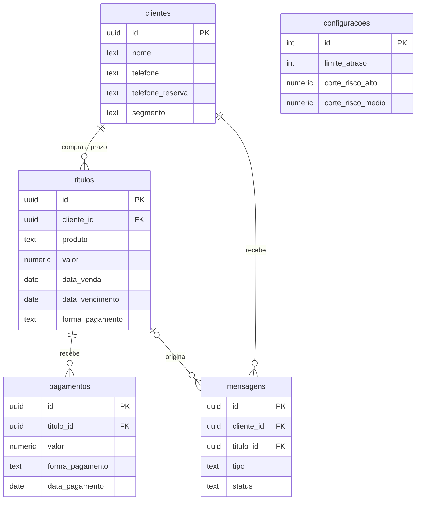

# Central de Crédito

> Sistema web para controlar **vendas a prazo ("fiado")**: quem deve, quanto, até quando — e quem tem mais risco de não pagar.

*English summary: a web app to manage store-credit ("pay later") sales — customers, receivables, partial payments, default-risk scoring and, on the roadmap, WhatsApp collection reminders and a cash-flow forecast. Built with Next.js (App Router + Server Actions) and Supabase (PostgreSQL).*

**Status:** 🚧 em desenvolvimento — Fases 1 a 2b concluídas; Fase 3 (motor de risco) em andamento.

---

## O problema

Pequenos negócios que vendem a prazo costumam controlar tudo em caderno ou planilha: fica difícil saber quem está atrasado, quanto falta receber e de quem cobrar primeiro.

Este é um projeto real, desenvolvido sob demanda para um cliente, e vai ser usado no dia a dia por **uma pessoa idosa**. Por isso o critério de design mais importante é **simplicidade**: poucos passos, botões grandes, mensagens claras em português e confirmação antes de qualquer ação que não dá pra desfazer.

## O que já funciona

- Cadastro de cliente **junto com a primeira compra**, num único formulário.
- Lista de clientes e **ficha do cliente** com todos os títulos: valor, pago, restante, vencimento, forma de pagamento e status (em aberto / atrasado / pago).
- **Pagamento parcial**, com validação para não pagar mais do que falta.
- **Marcar título como pago** e **marcar tudo como pago** (todos os títulos em aberto do cliente de uma vez).
- **Nova compra** para cliente já cadastrado: quem quitou tudo continua salvo, com o histórico, sem precisar de novo cadastro.
- Mensagens de sucesso/erro, confirmação antes de marcar como pago e proteção contra clique duplo.

## Decisões técnicas (e por quê)

| Decisão | Motivo |
|---|---|
| **Sem tela de login; todo acesso ao banco é server-side** (Server Components / Server Actions com a chave `service_role`) | Ferramenta de um único negócio, sem multiusuário. A chave nunca chega ao navegador. Se um dia houver mais de um usuário, o próximo passo é adicionar autenticação. |
| **RLS ligado em todas as tabelas, sem nenhuma política** | Bloqueia totalmente a chave pública (`anon`) caso ela seja usada por engano no navegador. |
| **Pagamentos em tabela própria** (uma linha por pagamento), não um campo acumulado | Dá histórico, permite forma de pagamento diferente por parcela e corrigir um lançamento sem bagunçar o total. |
| **Saldo calculado numa view SQL** (`titulos_com_saldo`) | Fonte única da verdade: `valor_pago`, `valor_restante`, `dias_atraso` e `status` nunca são recalculados à mão nas telas. |
| **Dinheiro em centavos inteiros no código** e `numeric(12,2)` no banco | Evita erros de ponto flutuante ao comparar e somar valores. |
| **"Hoje" no fuso de Brasília** (`America/Sao_Paulo`), na view e no app | O banco roda em UTC: sem isso, a partir das 21h um título que vence hoje aparecia como atrasado. Bug real, encontrado e corrigido. |
| **Ações idempotentes** | "Marcar como pago" relê o saldo no servidor na hora do clique; um clique duplo não paga duas vezes. |
| **Server Actions em vez de API routes** | Menos código e menos superfície: cada formulário chama direto a função do servidor. |

## Modelo de dados



Além das tabelas, a view `titulos_com_saldo` entrega cada título já com saldo, dias de atraso e status. O schema completo está em [`supabase/schema.sql`](supabase/schema.sql).

## Stack

- **Next.js** (App Router) com **React 19**, em JavaScript puro
- **Supabase** (PostgreSQL) via `@supabase/supabase-js`
- CSS simples, só o necessário para legibilidade (o redesign visual é a Fase 8)

## Roadmap

| Fase | Entrega | Status |
|---|---|---|
| 1 | Schema no Supabase + projeto Next.js rodando | ✅ |
| 2a | Cadastro de cliente + primeira compra, lista de clientes, ficha | ✅ |
| 2b | Pagamento parcial, marcar como pago, nova compra, "marcar tudo como pago" | ✅ |
| 3 | **Motor de risco**: nota de 0 a 100 por cliente (atraso atual, perfil de cliente novo × antigo, mudança de padrão), com parâmetros configuráveis | 🚧 |
| 4 | Tela "Hoje": o que precisa de atenção agora | ⏳ |
| 5 | Previsão de caixa | ⏳ |
| 6 | Régua de cobrança via WhatsApp | ⏳ |
| 7 | Relatório semanal | ⏳ |
| 8 | Redesign visual | ⏳ |
| 9 | Testes finais e ajuste dos parâmetros com dados reais | ⏳ |

## Como rodar localmente

Pré-requisitos: Node.js 20+ e um projeto no [Supabase](https://supabase.com) (o plano gratuito basta).

1. `npm install`
2. No painel do Supabase, abra o **SQL Editor** e rode todo o conteúdo de [`supabase/schema.sql`](supabase/schema.sql).
   *(Se você já tinha criado o banco antes da correção de fuso horário, rode também [`supabase/correcao-fuso.sql`](supabase/correcao-fuso.sql).)*
3. Copie `.env.local.example` para `.env.local` e preencha (Supabase → Project Settings → API):
   - `SUPABASE_URL` → Project URL
   - `SUPABASE_SERVICE_ROLE_KEY` → chave **service_role** (não a "anon")
4. `npm run dev` e abra <http://localhost:3000>

## Estrutura do projeto

```
app/
  page.js                     Início
  clientes/
    page.js                   Lista de clientes
    novo/                     Cadastro (formulário + Server Action)
    [id]/
      page.js                 Ficha do cliente e ações nos títulos
      actions.js              Server Actions: pagamento parcial, marcar como pago
      nova-compra/            Nova compra para cliente existente
  componentes/BotaoAcao.js    Botão com confirmação e trava contra clique duplo
lib/
  supabase-server.js          Cliente Supabase (somente servidor)
  util.js                     Moeda, datas, centavos, "hoje" no fuso de Brasília
supabase/
  schema.sql                  Schema completo (tabelas, view, RLS)
  correcao-fuso.sql           Correção de fuso para bancos já existentes
```

## Screenshots

Serão adicionadas após o redesign visual (Fase 8), com dados fictícios.

## Autor

Desenvolvido por **Kaue Souza**.
